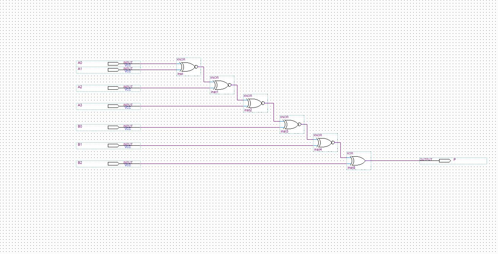

## Requisitos

> **Dica 1a (Paridade):** O display **HEX7** deve mostrar 0 ou 1, indicando o bit de paridade par do _total_ de bits '1' das senhas corretas (A e B unidas).

## Detalhes

Uma forma simples de verificar a paridade de uma série de bits é concatenando eles com XNOR. Ao final, o sinal P = 0 para paridade PAR e P = 1 para paridade IMPAR. No entanto, queremos o inverso e para isso basta negar o final.

